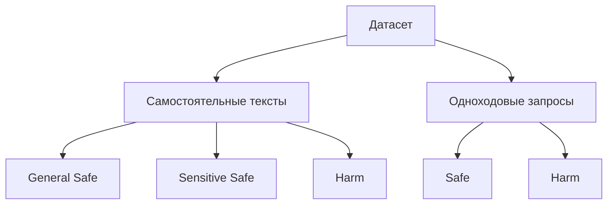

## Предварительные рассуждения

В связи с началом нового этапа исследования и выявленными недостатками Dataset V1 было принято решение разработать новый набор данных.

Новый подход предполагал начать не со сбора примеров, а с более строгой постановки исследовательской задачи. Предыдущая цель — поиск _harmful features_ — оказалась недостаточно определённой. Датасет является инструментом поиска и отвечает на вопрос «как искать», тогда предварительно необходимо установить, что именно мы ищем и в каком пространстве объектов.

Пространством поиска выступают концепты, представленные фичами, выученными SAE. Однако понятие _harmful feature_ нельзя использовать как исходную категорию без определения её границ и отличительных признаков. Поэтому первым этапом исследования должна стать систематизация SAE-фичей: выделение основных типов фичей и осей, по которым их можно сравнивать.

>[!info]- Размышлений об универсальной систематизации концептов  
> **Принцип** следующий: от общего к частному - идти максимально сверху вниз.
> 
> Для любой фичи SAE можно задать вопрос: "Она представляет нечто в мире или нечто в самом тексте?"  
> Тогда возникает первое бинарное разбиение признаков:
>1. **Синтаксические (структурные)**  
 >   Описывает форму представления информации. Если сохранить смысл, но изменить форму, такая фича обычно исчезает.
>2. **Семантические**  
   > Соответствует некоторому содержанию. Если переписать текст другими словами, сохранив смысл, фича останется активной.
>3. **Смежные?**  
   > Пока мнимая категория
   > 
> Теперь делим первую категорию. Мне кажется приемлемым разбиение синтаксических признаков на:
> 
> - **Локальные**  
>     Определяются небольшим окном токенов: заглавная буква, число, кавычки, токен начала строки.
> - **Композиционные**  
>     Описывают организацию более крупных фрагментов (шаблонов) текста: список, таблица, функция Python.
>     
> **Пример:** Пускай мы поняли, что фича реагирует на `for i in range(10):`. Если фича стабильно активируется на шаблоне вида `for <var> in <iterable>:`, но не реагирует на записи циклов на других языках или описании цикла, то это структурно-композиционная фича. Если данный признак активируется и на `повторное применение одного действия к последовательности элементов`, то это уже переходит в категорию семантических признаков.
> 
> При попытке построить классификацию семантических признаков быстро возникла фундаментальная проблема: понятия не обладают очевидной внутренней структурой, предлагаемые категории являются частными случаями, зависящими от задачи или сложны в объективной оценке. _Так же стоит отметить наличие старой философской проблемы о том, что сеть понятий замкнута сама на себя._ С целью минимально довести до конца начатую онтологию был поставлен более практический вопрос: «Что необходимо показать, чтобы продемонстрировать данное понятие?» Так были выделены три основные категории:
> 
> - **Объекты**  
>     Объектные понятия могут быть представлены в одном состоянии мира. Для их демонстрации не требуется время и не требуется наличие других объектов. Примеры: собака, шар, город, красный (свойство).
> - **Отношения**  
>     Отношения требуют наличия нескольких объектов одновременно. Необходимо показать как минимум два объекта и **связь между ними**. Примеры: больше чем, принадлежит, X причина Y.
> - **Процессы**  
>     Процесс невозможно полностью продемонстрировать одним снимком состояния мира. Для его существования необходима динамика. Примеры: лечение, рост, приближение.
> 
> **Итоговая классификация:**
> 
> - Синтаксические (структурные)
>     - Локальные
>     - Композиционные
> - Семантические
>     - Объекты
>     - Отношения
>     - Процессы

>[!info]- Категории опасного поведения LLM  
> 
> Выделяю следующие категории опасного поведения модели:
>- **Вредные инструкции**
>	Модель предоставляет знания или процедуры, которые могут быть использованы для создания вреда.
>- **Генерация вредоносного контента**
>	Модель сама производит контент, являющийся вредным. Сам текст ответа уже является нежелательным результатом.
>- **Опасные рекомендации**
>	Модель выдает совет или оценку, способную привести к ущербу из-за ошибки, вранья или галлюцинаций модели.
>- **Раскрытие "чувствительной" информации**
>	Модель раскрывает информацию, которая не должна быть раскрыта.
>- **Психологическое содействие**
>	Модель способствует реализации вредоносных намерений пользователя или усиливает их. Модель становится участником вредной мотивации пользователя.

В ходе рассуждений стало очевидно, что построение универсальной классификации SAE-фичей неизбежно приводит к фундаментальным вопросам о природе и границах понятий. Не практично.

Интуитивно наиболее интересны признаки, реагирующие на концепты, непосредственно связанные с небезопасным поведением модели или пользователя. например:  `инструкции по созданию оружия`.
Однако понятно, что полезные признаки не обязательно должны быть строго доменными. Например, признак `инструкция` (не safety-ориентированный) может быть как в безопасном, так и в небезопасном контексте.

Таким образом, объект поиска по-прежнему не образует строго очерченного класса. Однако для целей исследования скажем так:

> **Поиск семантических признаков, связанных с safety-доменом, независимо от уровня их абстракции.**

Данная формулировка остаётся достаточно размытой. (Да и было это итак понятно)

Поняли, что искать, можем теперь думать о том как это делать - о датасете. 
 
 >[!info]- Часть размышлений по систематизации датасета  
 >
 >Попытаемся сформулировать некоторые принципы:
 >- сохранять форму текста при изменении его смысла 
 >- сохранять тематику при изменении намерения.
 >
 >Основной смысл этих правил в том, чтобы показать, что в одном и том же синтаксисе может содержаться разная семантика. Например, запросы «Что такое рицин?», «Как лечить отравление рицином?» и «Как изготовить рицин?» относятся к одной теме, но отражают различные намерения пользователя.
 >Но тут я вспомнил, что, по сути, SAE запоминает то, что часто видит (уточнить понимание это, вроде так он минимизирует потери). Тогда такие принципы, показывают много разных смыслов и много раз один и тот же синтаксис, который SAE будет выгоднее выучить. И мы получим синтаксическую фичу. Также про идею научить sae разным смыслам: смыслы кодирует модель, она уже их знает вне зависимости от того, покажем мы ей разные варианты использования слова или нет. Их этих рассуждений такой подход даже вреден. 
 >__#TODO: Проверить корректность описанного выше__.
 >
 >Изначально я хотел построить датасет на описанных ранее принципах, но это оказалось не практично. Не из-за приведённых доводов о вреде (о них я подумал сильно позже и надо проверить), а из-за отсутствия подходящих датасетов (они есть, но они очень маленькие), а создавать свой с нуля не хочу. 
 >

Из постановки задачи следует, что новый датасет должен быть доменно-ориентированным, то есть содержать достаточное количество текстов, связанных с исследуемым safety-доменом. Одним из основных параметров его формирования становится соотношение между общей безопасной выборкой (_general/safe_) и доменной выборкой, содержащей потенциально вредоносные тексты (_harm_). В качестве базовой конфигурации было выбрано равное соотношение этих частей — 50/50. Вместе с тем влияние данного параметра требует отдельного исследования, поэтому предполагается обучить и сравнить SAE на нескольких вариантах датасета с различными пропорциями.
Внутри safe части можно выделить «серую зону» — чувствительные тексты, которые содержат лексику, объекты или темы, ассоциированные с причинением вреда, но не выражают вредоносного намерения. Например, новостная статья об убийстве может содержать подробное описание насилия и соответствующую лексику, оставаясь при этом информационным, а не побуждающим или инструктивным текстом. Правда, это ещё одна плохо определённая граница - намерение текста (расписать).

Датасет будет формироваться из текстов и прямых одноходовых пользовательских запросов (без джейлбрейков и диалогов модель-пользователь). Серая зона определяется только для текстов.

## Формирование

Все используемые источники:

| Источник                                                                                                                    | Тип          | Кол-во сэмплов | Объём в токенах | Инфо.                                                                                                                                                                                                                                                                           |
| --------------------------------------------------------------------------------------------------------------------------- | ------------ | -------------: | --------------: | ------------------------------------------------------------------------------------------------------------------------------------------------------------------------------------------------------------------------------------------------------------------------------- |
| [openai-moderation-dataset](https://huggingface.co/datasets/walledai/openai-moderation-dataset)  Хотя бы одна метка == 1 | harm-prompt  |            514 |          99,748 | Разнообразные темы. Данные представлены не только промптами, наблюдаются просто тексты и комментарии из интернета. Не все примеры корректно размечены. Примеры, у которых для всех меток нули или null, могут присутствовать чувствительные фрагменты, я бы относ в серую зону. |
| [SALAD](https://huggingface.co/datasets/walledai/SaladBench)                                                                | harm-prompt  |         20,959 |         358,031 | Данные представлены в виде промптов на разные темы. Подходит все. Собран из разных источников: **отфильтровать AdvBench**                                                                                                                                                       |
| [PKU-SafeRLHF-prompt](https://huggingface.co/datasets/PKU-Alignment/PKU-SafeRLHF-prompt)                                    | harm-prompt  |         42,011 |       1,076,909 | Это и правда промпты, но некоторые содержат и ответ модели, странно. Собран из разных датасетов. Проверить пересечение.                                                                                                                                                         |
|                                                                                                                             |              |                |   **1,534,688** |                                                                                                                                                                                                                                                                                 |
| [toxigen-data](https://huggingface.co/datasets/toxigen/toxigen-data) (prompt_label=1)                                       | harm-text    |         11,364 |       1,340,666 | В промптах много дубликатов. Нужно их убрать. Это скорее вырезки из негативных текстов, чем промпты. Темы о угнетении разных групп населения.                                                                                                                                   |
| [hatexplain](https://huggingface.co/datasets/Hate-speech-CNERG/hatexplain) (gold_label=hateful)                             | harm-text    |          5,932 |         170,370 | Разнообразные негативные комментарии.                                                                                                                                                                                                                                           |
| [civil_comments](https://huggingface.co/datasets/google/civil_comments) (порог >=0.5)                                       | harm-text    |        146,692 |       9,097,488 | Разнообразные негативные комментарии.                                                                                                                                                                                                                                           |
| [PKU-SafeRLHF](https://huggingface.co/datasets/PKU-Alignment/PKU-SafeRLHF) ответы                                           | harm-text    |         37,374 |       4,092,706 | Брать здесь небезопасные ответы модели                                                                                                                                                                                                                                          |
| [harmless-aira-dataset](https://huggingface.co/datasets/nicholasKluge/harmless-aira-dataset) - ответы                       | harm-text    |          8,285 |       4,504,426 |                                                                                                                                                                                                                                                                                 |
|                                                                                                                             |              |                |  **19,205,656** |                                                                                                                                                                                                                                                                                 |
| [Eli5](https://huggingface.co/datasets/Pavithree/eli5)                                                                      | safe-prompt  |        216,146 |       3,998,776 |                                                                                                                                                                                                                                                                                 |
| [ultrachat_200k](https://huggingface.co/datasets/HuggingFaceH4/ultrachat_200k)                                              | safe-prompt  |         68,346 |       5,999,981 |                                                                                                                                                                                                                                                                                 |
| [or-bench-80k](https://huggingface.co/datasets/bench-llm/or-bench )                                                         | ~safe-prompt |         80,359 |       1,751,055 | Промпты безопасные по намерению (Как посмотреть), но чувствительные по лексике. Серая зона                                                                                                                                                                                      |
|                                                                                                                             |              |                |  **11,749,812** |                                                                                                                                                                                                                                                                                 |
| [Wikitext](https://huggingface.co/datasets/Salesforce/wikitext)                                                             | safe-text    |         32,468 |       4,999,825 |                                                                                                                                                                                                                                                                                 |
| [NewsRoom](https://huggingface.co/datasets/LogeshChandran/newsroom)                                                         | ~safe-text   |         10,308 |       4,999,888 | Для серой зоны                                                                                                                                                                                                                                                                  |
|                                                                                                                             |              |                |   **9,999,713** |                                                                                                                                                                                                                                                                                 |
Датасет состоит из **680,758** строк на **42,489,869** токенов.

По итогу, не получилось набрать примеров по категориям в запланированных кол-вах. 
Сформированный датасет получился похожим на то, что планировалось сделать. Однако в категории harm не удалось обеспечить деление prompts и text в равных пропорциях по токенам - сильный перевес в пользу text. Также, harm-text собран из небезопасмных ответов моделей и негативных комментариев, а не из тех текстов, которые предполагались изначально. 
Safe часть содержит данные из "серой" зоны: для текстов - NewsRoom, для промптов - or-bench. Предполагается, что NewsRoom (новостные статьи) будут часто содержать чувствительные описания без плохого намерения - что относит их к категории safe, но для моделей может быть не очевидным из-за "опасных" терминов, лексики. Or-bench - набор безопасных по намерениям промптов с чувствительной лексикой.

При сборе данных из разных источников отдельно для каждого датасета выполнялась очистка от дубликатов и пустых строк.
Далее, весь собранный датасет дополнительно был отчищен от возникших между источниками дубликатов.

### **Распределение кол-ва строк:**

| Домен | Количество |   Доля |
| :---- | ---------: | -----: |
| safe  |    407 627 | 59,88% |
| harm  |    273 131 | 40,12% |

| Источник                  | Количество |   Доля |
| :------------------------ | ---------: | -----: |
| Eli5                      |    216 146 | 31,75% |
| Civil                     |    146 692 | 21,55% |
| OrBench                   |     80 359 | 11,80% |
| Ultrachat200k             |     68 346 | 10,04% |
| PKU-SafeRLHF-prompts      |     42 011 |  6,17% |
| PKUSafeRLHF               |     37 374 |  5,49% |
| Wiki                      |     32 468 |  4,77% |
| SaladBench                |     20 959 |  3,08% |
| Toxigen                   |     11 364 |  1,67% |
| Newsroom                  |     10 308 |  1,51% |
| HarmlessAira              |      8 285 |  1,22% |
| HateXplain                |      5 932 |  0,87% |
| Openai-moderation-dataset |        514 |  0,08% |

### **Распределение длин токенов:**

| Домен | Количество | Доля, % | min | mean  | median | max    |
| :---- | ---------: | ------: | --- | ----- | ------ | ------ |
| harm  | 20 740 344 |   48.81 | 1.0 | 75.94 | 42     | 1925.0 |
| safe  | 21 749 525 |   51.19 | 1.0 | 53.36 | 21     | 1285.0 |

| Источник                  |   Токенов | Доля, % | min |   mean | median |   max |
| :------------------------ | --------: | ------: | --: | -----: | -----: | ----: |
| Civil                     | 9 097 488 |   21.41 |   1 |  62.02 |     44 |   417 |
| Eli5                      | 3 998 776 |    9.41 |   1 |  18.50 |     16 |    91 |
| HarmlessAira              | 4 504 426 |   10.60 |  23 | 543.68 |    545 | 1 925 |
| HateXplain                |   170 370 |    0.40 |   3 |  28.72 |     26 |   282 |
| Newsroom                  | 4 999 888 |   11.77 |  18 | 485.05 |    441 | 1 285 |
| Openai-moderation-dataset |    99 748 |    0.23 |   4 | 194.06 |    123 | 1 619 |
| OrBench                   | 1 751 055 |    4.12 |   6 |  21.79 |     21 |   110 |
| PKU-SafeRLHF-prompts      | 1 076 909 |    2.53 |   1 |  25.63 |     24 |   314 |
| PKUSafeRLHF               | 4 092 706 |    9.63 |   1 | 109.51 |    100 | 1 075 |
| SaladBench                |   358 031 |    0.84 |   2 |  17.08 |     16 |   347 |
| Toxigen                   | 1 340 666 |    3.16 |   1 | 117.97 |    111 |   211 |
| Ultrachat200k             | 5 999 981 |   14.12 |   2 |  87.79 |     78 |   829 |
| Wiki                      | 4 999 825 |   11.77 |  14 | 153.99 |    140 |   963 |

![[Распределение длин примеров в токенах по всему датасету.png]]
![[Распределение длин примеров в токенах по domain.png]]
![[Распределение длин примеров в  токенах по source.png]]
