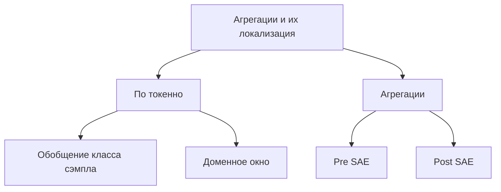

Теперь я бы поговорил о такой степени свободы как _"агрегации и их локализация"_.

Продолжая рассматривать вопрос об обобщении метки сэмпла на его элементы:

> Хотя мы знаем доменную метку для всего предложения, мы не можем напрямую утверждать, что каждый отдельный токен в этом предложении относится к домену. Тем не менее на практике метку всего предложения обычно обобщают на все его токены.

Допустим, у нас нет идеи `доменного окна` и мы не хотим бездумно обобщать класс сэмпла на токены. Тогда можно рассмотреть агрегаций. 
#### Pre SAE mean
Можно усреднить активации токенов для данного сэмпла и получить активацию, характеризующую все предложение. 
Интересный вариант, но пока не очевидно, насколько хорошо это может работать. 
Я бы мог опасаться того, что такое усреднение может дать активации сильно отличающиеся от привычного распределения.

Провел эксперимент [[E1]]. Стоит ли его масштабировать на разные модели, слои и SAE?
#### Post SAE mean
Усреднить можно вектора активации фич - после прохождения через SAE - для данного предложения.
>==Необходимо провести эксперименты.==
#### Post SAE max
Для векторов активаций фич - после прохождения через SAE - можно выполнить `max pooling` для данного предложения.
>==Необходимо провести эксперименты.==

### Полная картина
Всё это складывается в стройную картину.

