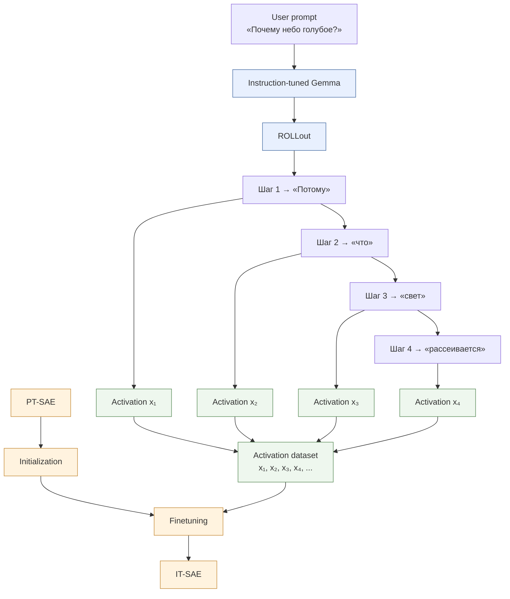

> [!tip]
> Данный документ я в первую очередь пишу для себя, фиксируя важные для меня моменты (которые решил освежить, или не понимал, или понимал неправильно). Они не обязательно напрямую влияют на работу. 
> 
> **Можно пропустить**

Для того, чтобы выполнить правильное обучение SAE необходимо повторить и уточнить понимание этого инструмента.

## Определение SAE

> [!quote] Фрагмент статьи [GemmaScope2](https://storage.googleapis.com/deepmind-media/DeepMind.com/Blog/gemma-scope-2-helping-the-ai-safety-community-deepen-understanding-of-complex-language-model-behavior/Gemma_Scope_2_Technical_Paper.pdf)
> 
> Пусть $x \in \mathbb{R}^n$ — активация, полученная из языковой модели.
> 
> Sparse autoencoder (SAE) раскладывает и затем восстанавливает эту активацию с помощью пары функций **encoder** и **decoder**, $f$ и $\hat{x}$, определённых следующим образом:
> 
> $$
> f(x) := \sigma(W_{\mathrm{enc}}x + b_{\mathrm{enc}}).
> \tag{1}
> $$
> 
> $$
> \hat{x}(f) := W_{\mathrm{dec}}f + b_{\mathrm{dec}}.
> \tag{2}
> $$
> 
> Эти функции обучаются таким образом, чтобы отображать $\hat{x}(f(x))$ обратно в $x$, поэтому такая модель и называется **autoencoder**.
> 
> Таким образом,
> $$
> f(x) \in \mathbb{R}^M
> $$
> 
> представляет собой набор линейных коэффициентов, задающих, как скомбинировать $M \gg n$ столбцов матрицы $W_{\mathrm{dec}}$, чтобы восстановить $x$.
> 
> Столбцы $W_{\mathrm{dec}}$, которые мы обозначаем как $d_i$, где $i = 1, \ldots, M$, представляют словарь направлений, на которые SAE раскладывает $x$.
> 
> Мы будем называть эти выученные направления **latents**, чтобы отличать выученные SAE-признаки от концептуальных **features**, которые, согласно гипотезе, составляют representation vectors языковой модели.
> 
> Разложение $f(x)$ делается неотрицательным и разреженным за счёт выбора функции активации $\sigma$ и соответствующей регуляризации, так что обычно $f(x)$ имеет значительно меньше $n$ ненулевых элементов.
> 
> В первоначальных работах ([Bricken et al., 2023]; [Cunningham et al., 2023]) использовалась функция активации **ReLU** для обеспечения неотрицательности и **L1 penalty** на разложение $f(x)$ для стимулирования sparsity.
> 
> **TopK SAE** (Gao et al., 2024) обеспечивает sparsity, зануляя все элементы $f(x)$, кроме $K$ наибольших.
> 
> **JumpReLU SAE** (Rajamanoharan et al., 2024b) обеспечивает sparsity, зануляя все элементы $f(x)$, которые находятся ниже некоторого положительного **threshold**.
> 
> И TopK, и JumpReLU SAE позволяют сильнее разделить две задачи: определение того, какие **latents** активны, и оценку величины их активации.

^5fe967

### Encoder $W_{\mathrm{enc}}$

Изначально я представлял $W_{\mathrm{enc}}$ как набор направлений, с которыми SAE напрямую сравнивает текущую activation $x$, примерно как поиск наиболее похожих направлений: для каждого $w_i$ вычисляется, насколько хорошо оно «совпадает» с $x$, и чем больше значение, тем сильнее соответствует activation этому направлению. 

Это близко к правильной интуиции, но неточно в части «сходства»: $W_{\mathrm{enc}}\in\mathbb{R}^{M\times n}$ действительно состоит из $M$ обучаемых линейных детекторов $w_i$, каждый из которых вычисляет `score` $a_i=w_i^\top x+b_i$, однако этот score является не cosine similarity и вообще не является чистой мерой совпадения направлений. Он зависит от нормы $x$, нормы $w_i$, угла между ними и bias. Поэтому правильнее думать о $W_{\mathrm{enc}}$ как о наборе обученных линейных детекторов: каждый $w_i$ оценивает, насколько текущая activation содержит сигнал, на который этот latent настроен, после чего JumpReLU/другой механизм sparsity решает, активировать latent или нет. 

### Decoder $W_{\mathrm{dec}}$

При этом $W_{\mathrm{enc}}$ не следует путать с $W_{\mathrm{dec}}$: encoder определяет, **когда и насколько активировать latent**, а decoder определяет, **какой вклад этот latent внесёт в реконструкцию**.

Столбцы decoder  $W_{\mathrm{enc}}$ — это выученные направления в пространстве активаций модели. Некоторые из этих направлений могут соответствовать интерпретируемым концептуальным features модели.


## JumpRelu SAE

> [!tip] Предполагается основной архитектурой в исследовании

JumpReLU сохраняет общую структуру `encoder → decoder`, но заменяет `ReLU + L1` другим механизмом разреживания. Для каждого $a_i$ из  $[a_1, a_2, ... a_n] = W_{\mathrm{enc}}x + b_{\mathrm{enc}}$ вводится отдельный обучаемый threshold $θ_i$​:
$$  
z_i =  
\begin{cases}  
a_i, & a_i > \theta_i,\\  
0, & a_i \leq \theta_i.  
\end{cases}  
$$
Один общий threshold для всех latents был бы слишком грубым ограничением. Поэтому
$$  
\theta_1,\theta_2,\ldots,\theta_M  
$$
обучаются отдельно.

**Почему threshold обучаемый и почему он свой для каждого latent?** 
Потому что разные $a_i$ имеют разные распределения encoder scores. Один $a_i$ может быть полезен уже при относительно небольшом score, а другой должен включаться только при гораздо более сильном сигнале. 

**Касательно последнего предложения [[#^5fe967|Фрагмента с определением]].**
В классическом SAE L1​-компонента loss одновременно стимулирует разреженность и уменьшение величин активаций, поскольку штраф пропорционален самим значениям $z_i​$. В JumpReLU sparsity-компонента loss фактически стимулирует модель уменьшать число активных latents, что достигается обучением thresholds $θ_i$​, но не штрафует размер активации уже активного latent-а. Поэтому threshold отвечает преимущественно за решение „активен или нет“, а значение $a_i​$ — за „насколько сильно активен“. В этом и кроется смысл слов про разделение задач.


## Заметки по [GemmaScope2](https://storage.googleapis.com/deepmind-media/DeepMind.com/Blog/gemma-scope-2-helping-the-ai-safety-community-deepen-understanding-of-complex-language-model-behavior/Gemma_Scope_2_Technical_Paper.pdf)

Буду черпать знание и методологию из [GemmaScope2](https://storage.googleapis.com/deepmind-media/DeepMind.com/Blog/gemma-scope-2-helping-the-ai-safety-community-deepen-understanding-of-complex-language-model-behavior/Gemma_Scope_2_Technical_Paper.pdf)

### Модификации функции ошибки
#### Quadratic L0 penalty
Происходит замена обычной `L0 penalty` на `Quadratic L0 penalty`.
Первый, по сути - `λ × количество активных латентов`, штрафа за каждый активный latent и требовал наибольшей разреженности.
`Quadratic L0 penalty` позволяет задать целевое **целевое количество активных латентов** $L_{0★}$.

`Quadratic L0 penalty` выглядит как:
$$
L = λ*(\frac{2}{L_{0★}})*(L_0 − L_{0★})^2
$$
где:
- $L_{0}$ — фактическое количество активных латентов;
- $L_{0★}$ — желаемое количество активных латентов.

То есть модель стремится **не просто уменьшить число активных латентов, а удерживать его около заданной цели**.
#### Frequency latent
Предлагается наказывать не просто за количество активных латентов, а отдельно за латенты, которые активируются слишком часто.
То есть **frequency — это доля входов, на которых данный latent активен**.

Думаю, идея следующая: часто активирующие латенты не выглядят как редкие, специфические feature. Возможно, они кодируют что-то слишком общее или вообще пытаются объяснить много разных вещей сразу. И потому, мы хотим от них избавиться.

### End-to-end SAE
Раньше SAE обучают по принципу **«хорошо восстанови внутренние активации модели»**, а теперь хотят, чтобы SAE ещё и **сохранял то поведение модели, которое действительно важно для её предсказаний**.
Закололось бы, что из хорошей реконструкции следует сохранение поведения модели, но это не так. SAE может очень хорошо реконструировать шум и какую-нибудь несущественную деталь, потому что это уменьшает MSE. А какая-нибудь маленькая компонента, которая критически влияет на ответ модели, может быть потеряна. Для MSE это нормально.

Поэтому авторы вводят **end-to-end finetuning**.
До этого SAE обучался отдельно от модели: `модель → activation → SAE`

Теперь делают иначе - пускают reconstructed activation **обратно через оставшуюся часть модели**: `модель → activation → SAE → reconstructed activation → модель дальше`.
Ответ модели на исходную и измененную активации сравнивают и учитывают как ошибку.
$$
L_{\text{finetune}}
:=
\mathrm{MSE}
+
\alpha \frac{\beta}{1+\beta}
\mathrm{KL}\bigl(p(x), p(\hat{x})\bigr)
$$
Подробнее можно узнать в статье.

Это интересная информация, я как раз задумывался о том, что SAE (а dSAE, скорее всего, и подавно) может ухудшать "когнитивные" способности модели. Такой подход, кажется решением проблемы.
### IT-SAE
В статье отдельно рассмотрены инструктивные модели и обучение для них SAE.
Авторы, для обучения sae на it-моделях, используют не просто случайные активации входа, как для PT-SAE, а активации токенов генерируемого ответа (в процессе rollout).

И ещё: IT-SAE не обучают с нуля. Берут соответствующий PT-SAE и дообучают его на activation из rollout:

Схемы:
```
Forward 1:
[A B C]
         ↓
       predict D

Forward 2:
[A B C D]
       ↑
     xD ← можно взять activation D
         ↓
       predict E
```



Зачем? Чтобы SAE изучал признаки, характерные для того, **как instruction-tuned модель реально работает при выполнении пользовательских запросов**.

И это тоже важная информация. Я задавался вопросом о том, чему соответствует латент SAE: концепту входы или концепту выхода? Конкретного ответа не знаю, можно сказать, что SAE не учит напрямую «концепты входа» или «концепты выхода». 
Но обучение на активациях ответа делает некоторый сдвиг. Мне кажется, что в связке с chat-template модели это может открыть путь к анализу формирования ответов моделью.

**Я бы поставил такой вопрос:**
Когда мы аблируем (зануляем) конкретный SAE-latent, что именно мы причинно изменяем в модели: убираем определённый концепт из её представления входного контекста или вмешиваемся в формирование её внутреннего состояния и последующего ответа? Как это зависит от позиции токена и слоя, на которых выполняется intervention?

**Гипотеза:**
Это зависит от того, где мы вмешиваемся.
Если аблируем latent на позиции токена промпта, мы изменяем внутреннее представление этой части контекста. Если latent действительно кодирует некоторую информацию, модель может частично «потерять» её при дальнейших вычислениях.
Если аблируем latent на позиции сгенерированного токена, мы вмешиваемся уже в текущее внутреннее состояние модели во время формирования ответа.

