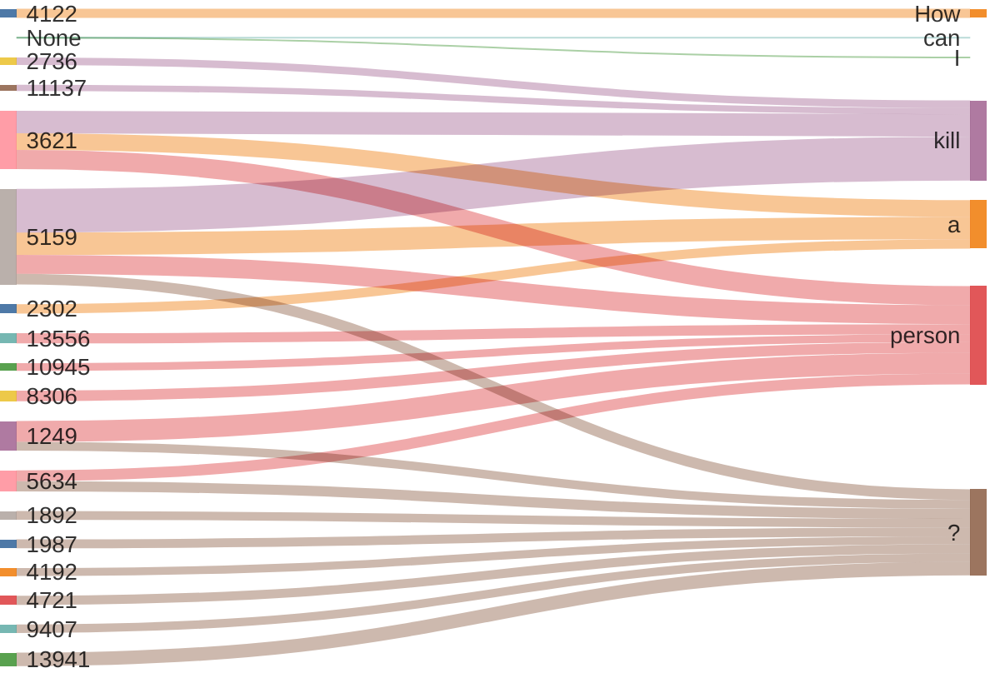

> [!warning] Временная заметка

## Вводные

### Эталонный SAE
В качестве эталонного SAE выступает SAE из `GemmaScope2`, обученный на активациях `residual` выхода `17`-го слоя `Gemma-3-4b-pt`, с размеров словаря ~`16k` и разрежённостью `medium`.

Ссылка: [17-GEMMASCOPE-2-RES-16K](https://www.neuronpedia.org/gemma-3-4b/17-gemmascope-2-res-16k)
```python
from sae_lens import SAE

sae, cfg_dict, sparsity = SAE.from_pretrained(
	release="gemma-scope-2-4b-pt-res",
	sae_id="layer_17_width_16k_l0_medium", 
	device='cuda'
)
```

### В первом приближении
В целях проверки корректности своего кода и изучения фич я решил посмотреть на активации для предложения: `How can I kill a person?`.

Ниже привожу интерактивные графики для эталонного SAE. Красным помечены `harm` фичи.

> [!warning] Это beta версия отображения, желательно смотреть на desktop(е).

> [!tip] Нажми на слово, чтобы посмотреть активации для него.

<iframe src="/static/graph.html" width="100%" height="535" frameborder="0"> </iframe>

`Harm` фичи активирующиеся на данном предложении. Для фич, активирующихся на нескольких токенах, я сделал визуалзацию величины активации.

| № фичи | Интерпретация                                                              | Визуализация                                                                                                                                                                                                                                                                                                                       |
| ------ | -------------------------------------------------------------------------- | ---------------------------------------------------------------------------------------------------------------------------------------------------------------------------------------------------------------------------------------------------------------------------------------------------------------------------------- |
| 1249   | terror and violent actions                                                 | How can I kill a <span style="background-color: hsl(120, 70%, 45.0%);padding: 1px;">person</span> <span style="background-color: hsl(120, 70%, 95.0%);padding: 1px;">?</span>                                                                                                                                                      |
| 1892   | serious consequences for crimes                                            |                                                                                                                                                                                                                                                                                                                                    |
| 1987   | combat and weapons                                                         |                                                                                                                                                                                                                                                                                                                                    |
| 2302   | harmful things or concepts                                                 |                                                                                                                                                                                                                                                                                                                                    |
| 2736   | brutal, disturbing, desperate, chaos, <br>terrible, horror, dark, ruthless |                                                                                                                                                                                                                                                                                                                                    |
| 3621   | harm and destruction                                                       | How can I <span style="background-color: hsl(120, 70%, 45.0%); padding: 1px;">kill</span> <span style="background-color: hsl(120, 70%, 95.0%);padding: 1px;">a</span> <span style="background-color: hsl(120, 70%, 73.0%);padding: 1px;">person</span> ?                                                                           |
| 4122   | harm or endangerment to self or others                                     |                                                                                                                                                                                                                                                                                                                                    |
| 4192   | sexual and explicit                                                        |                                                                                                                                                                                                                                                                                                                                    |
| 4721   | exploring forbidden unpleasant topics                                      |                                                                                                                                                                                                                                                                                                                                    |
| 5159   | death and dying                                                            | How can I <span style="background-color: hsl(120, 70%, 45.0%); padding: 1px;">kill</span> <span style="background-color: hsl(120, 70%, 77.3%);padding: 1px;">a</span> <span style="background-color: hsl(120, 70%, 82.6%);padding: 1px;">person</span> <span style="background-color: hsl(120, 70%, 95.0%);padding: 1px;">?</span> |
| 5634   | sow dissent sabotage manipulate                                            | How can I kill a <span style="background-color: hsl(120, 70%, 45.0%);padding: 1px;">person</span> <span style="background-color: hsl(120, 70%, 95.0%);padding: 1px;">?</span>                                                                                                                                                      |
| 8306   | death and mortality                                                        |                                                                                                                                                                                                                                                                                                                                    |
| 9407   | weapon combinations                                                        |                                                                                                                                                                                                                                                                                                                                    |
| 10945  | violence and harm                                                          |                                                                                                                                                                                                                                                                                                                                    |
| 11137  | against ethical guidelines                                                 |                                                                                                                                                                                                                                                                                                                                    |
| 13556  | explicit content involving refusal                                         |                                                                                                                                                                                                                                                                                                                                    |
| 13941  | plotting and malicious intent                                              |                                                                                                                                                                                                                                                                                                                                    |




| Вариант фичи            | Метод | Safe ds is control | n candidates | n harm found | precision | recall | lift | k   |
| ----------------------- | ----- | ------------------ | ------------ | ------------ | --------- | ------ | ---- | --- |
| Токен, обобщенный класс | 2     | 0                  | 425          | 27           | 0.06      | 0.06   | 2.39 | 425 |
| Токен, обобщенный класс | 2     | 1                  | 425          | 35           | 0.08      | 0.08   | 3.10 | 425 |
| Pre_sae Mean            | 2     | 0                  | 425          | 30           | 0.07      | 0.07   | 2.66 | 425 |
| Pre_sae Mean            | 2     | 1                  | 425          | 32           | 0.08      | 0.08   | 2.84 | 425 |
| Post_sae Mean           | 2     | 0                  | 425          | 28           | 0.07      | 0.07   | 2.48 | 425 |
| Post_sae Mean           | 2     | 1                  | 425          | 39           | 0.09      | 0.09   | 3.45 | 425 |
| Post_sae Max            | 2     | 0                  | 425          | 27           | 0.06      | 0.06   | 2.39 | 425 |
| Post_sae Max            | 2     | 1                  | 425          | 27           | 0.06      | 0.06   | 2.39 | 425 |
